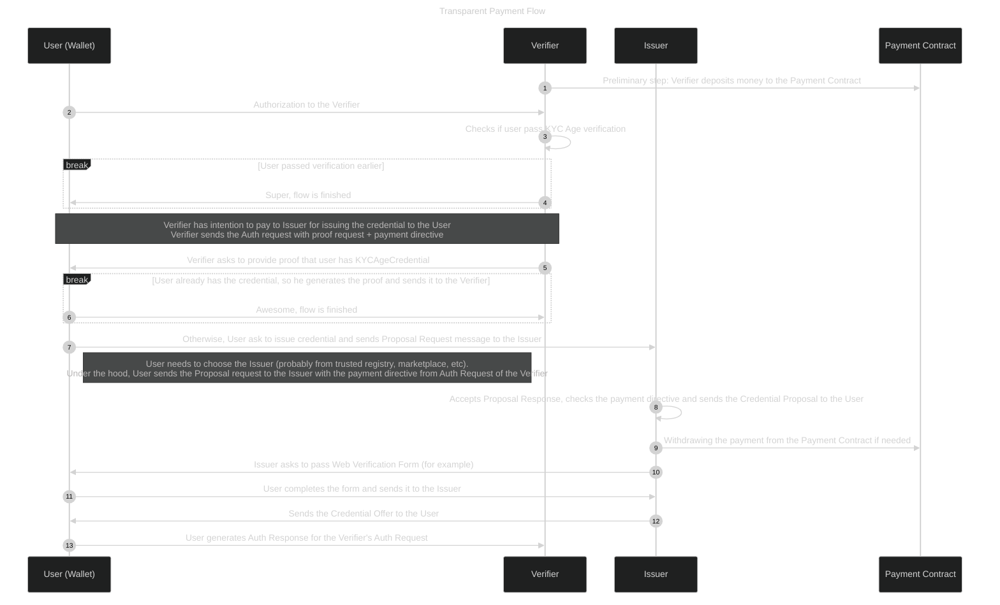

```mermaid
sequenceDiagram
    autonumber
    %%{init: {'theme': 'dark' } }%%
    title: Transparent Payment Flow
    participant U as User (Wallet)
    participant V as Verifier
    participant I as Issuer
    participant P as Payment Contract

    V->>P: Preliminary step: Verifier deposits money to the Payment Contract
    U->>V: Authorization to the Verifier

    V->>V: Checks if user pass KYC Age verification

    break User passed verification earlier
        V->>U: Super, flow is finished
    end

    Note over U,V: Verifier has intention to pay to Issuer for issuing the credential to the User<br/> Verifier sends the Auth request with proof request + payment directive

    V->>U: Verifier asks to provide proof that user has KYCAgeCredential

    break User already has the credential, so he generates the proof and sends it to the Verifier
        U->>V: Awesome, flow is finished
    end

    U ->> I: Otherwise, User ask to issue credential and sends Proposal Request message to the Issuer

    Note right of U: User needs to choose the Issuer (probably from trusted registry, marketplace, etc). <br/> Under the hood, User sends the Proposal request to the Issuer with the payment directive from Auth Request of the Verifier

    I ->> I: Accepts Proposal Response, checks the payment directive and sends the Credential Proposal to the User
    I ->> P: Withdrawing the payment from the Payment Contract if needed

    I ->> U: Issuer asks to pass Web Verification Form (for example)
    U ->> I: User completes the form and sends it to the Issuer
    I ->> U: Sends the Credential Offer to the User
    U ->> V: User generates Auth Response for the Verifier's Auth Request

```

